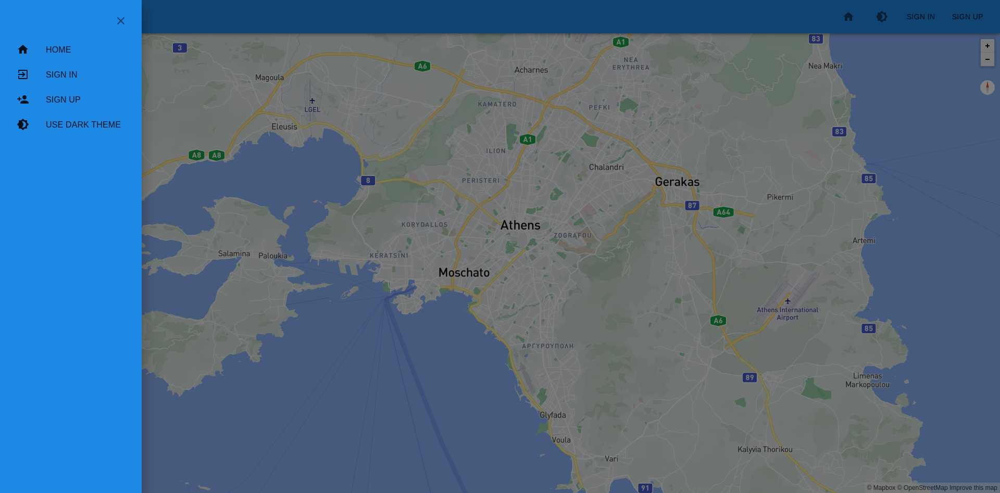

## My App


## Run locally
  ### Prerequisites
  - `node` >= 16.2.0
  - `yarn` >= 1.22.10
  - `nodeenv` >= 1.5.0
  
  ### Steps

  - **Clone project**
      ```
      git clone git@github.com:thanasislerai/my-app-website.git
      ```
  
  - **Create virtual environment**
    ```
    nodeenv -n 16.2.0 env --prebuilt
    source env/bin/activate
    ```

  - **Install dependencies**
    ```
    yarn install
    ```

  - **Set environment variables**
    ```
    cp .env.example .env
    ## Edit .env file
    ## A firebase API key is needed if you would like to enable authentication functionality
    ```

  - **Start project**
    ```
    yarn start
    ```

## Deployed version
You can find a deployed version of the project [here](https://my-app-3e25a.web.app/).
